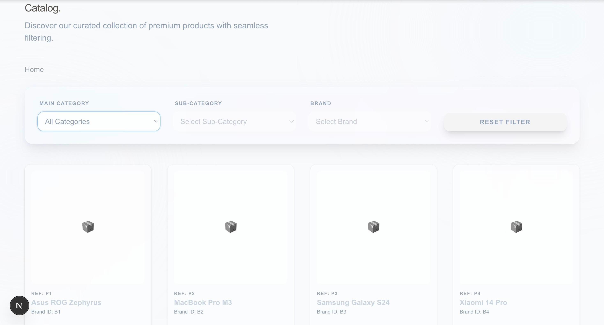
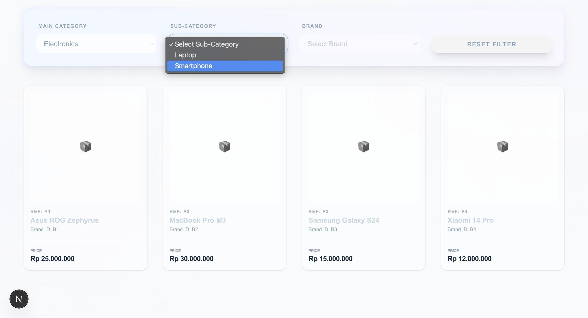
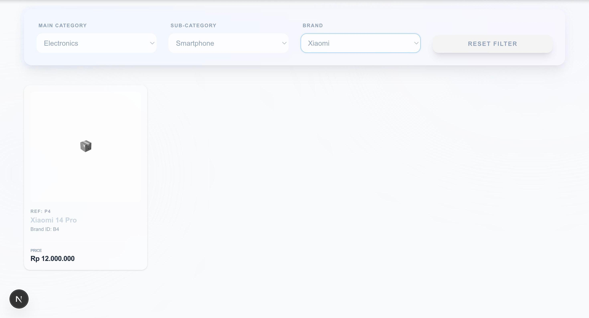

# 🛒 Cascading Dropdown Product Catalog

A premium, full-stack product filtering application built with **Next.js**, **TypeScript**, and **Tailwind CSS**. This project demonstrates an advanced implementation of cascading logic, and URL state management.

---

## ✨ Key Features

*   **Cascading Logic**: Intelligent dropdowns where choices in "Main Category" dynamically populate "Sub-Category," which subsequently filters the "Brand" options.
*   **URL State Persistence**: All filter selections are synchronized with the URL search parameters, ensuring that the user's view remains consistent even after a page refresh.
*   **Dynamic Breadcrumbs**: Fully functional breadcrumb navigation that updates in real-time based on the active filter path.
*   **Responsive Product Grid**: A compact and visually engaging product display using semantic HTML and CSS transitions.

---

## 📸 Visual Documentation

Below are screenshots of the application in action. These demonstrate the UI consistency and the functional cascading dropdowns.

### 1. Default Initial State
*On initial load, only the Main Category is enabled. The product grid shows all available items.*


### 2. Active Cascading Dropdowns
*Demonstrating the populated Sub-Category and Brand dropdowns after a category is selected.*


### 3. Populated Product List (Filtered)
*The product grid updates dynamically to match the specific filter criteria selected by the user.*


---

## 🛠️ Tech Stack

*   **Framework**: Next.js 
*   **Language**: TypeScript
*   **Styling**: Tailwind CSS
*   **Data Handling**: JSON Mock Data with simulated fetching
*   **Version Control**: Git & GitHub

---

## 🚀 Getting Started

### Installation

1. **Clone the repository**
   ```bash
   git clone [https://github.com/amanahsuci/cascading-dropdown.git](https://github.com/amanahsuci/cascading-dropdown.git)
   cd cascading-dropdown 
   ```

2. **Install dependencies**
   ```bash
    npm install
    ```

3. **Run the development server**
    ```bash
    npm run dev
    # or
    yarn dev
    # or
    pnpm dev
    # or
    bun dev
    ```

Open [http://localhost:3000](http://localhost:3000) with your browser to see the result.
